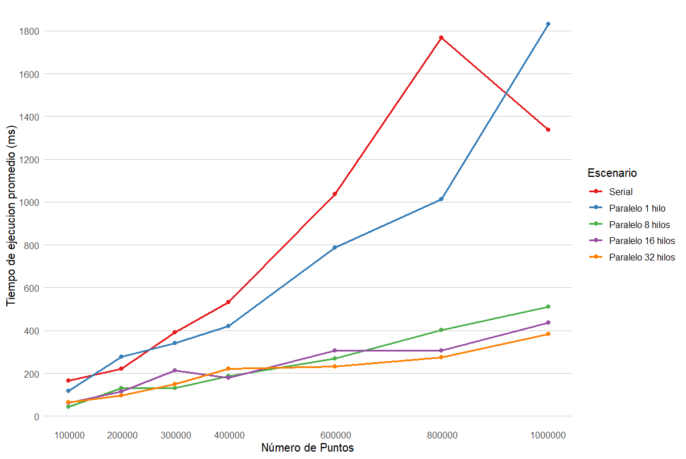

# Proyecto: K-means con OpenMP

## Cómputo Paralelo y en la Nube. Primavera 2025. ITAM

### Introduccion

- El programa lee un csv con puntos generados aleatoriamente, con sus coordenadas `x` y `y` generadas aleatoriamente entre 0 y 1 y regresa un csv con los mismos puntos y su cluster asociado.
- Puntos creados con el archivo `synthetic_clusters.ipynb` obtenido del repositorio del curso [computoparalelo2025a](https://github.com/octavio-gutierrez/computoparalelo2025a)
- Se presenta un codigo en version serial y un codigo en version paralela, asi como estrategia de paralelizacion, experimentos y analisis de resultados
- Los experimentos consisten en correr 10 veces el algoritmo y obtener promedios del tiempo ejecucion variando las siguientes componentes:
  - Numero de puntos (100000, 200000, 300000, 400000, 600000, 800000, 1000000)
  - Numero de hilos (1, `num_cores_virtuales`/2, `num_cores_virtuales`, `num_cores_virtuales`*2)
- Los experimentos fueron ejecutados en un equipo con las siguientes caracteristicas:
  - MSI Thin GF63 12VF
  - Procesador 12th Gen Intel(R) Core(TM) i7-12650H   2.30 GHz
  - 16 cores virtuales
  - 32 GB de memoria RAM
  - Tarjeta Grafica NVIDIA GeForce RTX 4060 Laptop GPU (16 GB)
  - Ejecutado dentro de un subsistema de Linux (WSL2) con distribucion de Ubuntu (Ubuntu 22.04.5 LTS)
  - Se utilizo VS Code como editor de texto usando la extension oficial de Microsoft `C/C++`

### Codigo Serial

- El algoritmo en pseudocodigo esta dado por:
  1. Crear `k` centroides y distribuirlos aleatoriamente sobre los datos
  2. Asignar los puntos al centroide mas cercano
  3. Actualizar la posicion de los centroides obteniendo los promedios de las posiciones en `x` y en `y`
  4. Repetir los pasos 2. y 3. hasta que ningun punto cambie de cluster
- Para esta implementacion del algoritmo de k-means, se utilizo la distancia euclidiana

### Codigo Paralelo

- Como estrategia de paralelizacion, se decidio utilizar paralell fors en las siguientes secciones:
  - Al calcular la distancia de cada punto a cada cluster center y hacer la asignacion
  - Al mover los cluster centers
- Es importante notar que, como el criterio de convergencia es que ningun punto cambie de cluster center, era necesario determinar cuantos puntos habian cambiado de lugar. Esto implica que se uso un paralell for con una operacion de reduccion de suma para determinar el total de puntos que habian camibiado de cluster centers

### Resultados

| Número de Puntos | Serial (ms) | Paralelo (1 core) (ms) | Paralelo (8 cores) (ms) | Paralelo (16 cores) (ms) | Paralelo (32 cores) (ms) |
|------------------|-------------|------------------------|-------------------------|--------------------------|--------------------------|
| 100000           | 164.5       | 118.308                | 43.4041                 | 60.8701                  | 63.9812                  |
| 200000           | 221.5       | 276.516                | 131.622                 | 114.514                  | 97.2848                  |
| 300000           | 392.2       | 341.541                | 132.083                 | 214.489                  | 150.26                   |
| 400000           | 533.4       | 419.895                | 186.391                 | 179.459                  | 222.485                  |
| 600000           | 1036.1      | 788.043                | 269.145                 | 305.14                   | 231.537                  |
| 800000           | 1768.5      | 1013.31                | 401.796                 | 306.238                  | 273.631                  |
| 1000000          | 1335.8      | 1830.43                | 510.225                 | 436.382                  | 382.63                   |

> Tabla 1. Resultados tabulares de los experimentos realizados.

> Figura 1. Tiempo promedio de ejecución (10 iteraciones) vs numero de puntos.

- Podemos ver que antes de 600000 puntos, las versiones de 8, 16 y 32 cores tienen un comportamiento muy similar. Por lo tanto, antes de 600000 puntos se sugiere usar 8 cores, que ocupa menos recursos y da un buen resultado
- Despues de 600000 puntos, se observa que 32 cores esta claramente por debajo que el resto de escenarios. Realizaremos nuestro analisis con respecto a 32 cores suponiendo que estaremos trabajando con un numero de datos superior a 600000.

| Número de Puntos | Versión Serial (ms) | Versión 32 Cores (ms) | Speed Up |
|------------------|---------------------|----------------------|-----------|
| 100000           | 164.5               | 63.9812              | 2.571     |
| 200000           | 221.5               | 97.2848              | 2.277     |
| 300000           | 392.2               | 150.26               | 2.610     |
| 400000           | 533.4               | 222.485              | 2.397     |
| 600000           | 1036.1              | 231.537              | 4.475     |
| 800000           | 1768.5              | 273.631              | 6.463     |
| 1000000          | 1335.8              | 382.63               | 3.491     |

> Tabla 2. Speed ups presentados. Version serial vs 32 cores
